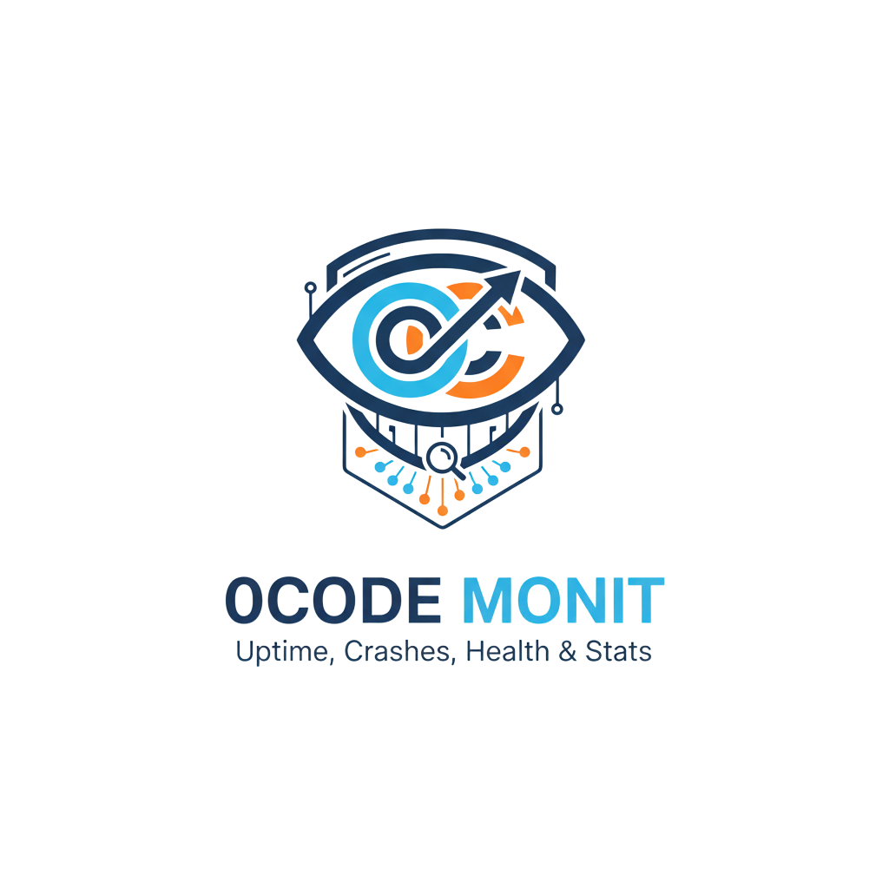

<div align="center" width="100%">
  
</div>

# 0Code-Monit

> Self-hosted monitoring with beautiful status pages, fast UI, and rich notifications.

<p align="center">
  
</p>

<p align="center">
  <a href="https://github.com/oggynjack/0Code-Monit"></a>
  <a href="https://github.com/oggynjack/0Code-Monit/releases"></a>
  <a href="https://github.com/oggynjack/0Code-Monit/actions"></a>
  <a href="LICENSE"></a>
</p>

<p align="center">
  
  
  
  
</p>

## ⭐ Features

- HTTP(S) / TCP / Keyword / JSON Query / Ping / DNS / Push / Steam game server / Docker containers
- Beautiful, reactive UI/UX with charts and dark mode
- 90+ Notification providers (Telegram, Discord, Slack, Email/SMTP, etc.)
- 20-second intervals
- Multi-language support
- Multiple status pages and custom domains
- SSL certificate info, proxy support, and 2FA

## 🔧 Quick Start

### 🐳 Docker

```bash path=null start=null
docker run -d --restart=unless-stopped \
  -p 3001:3001 \
  -v 0code-monit:/app/data \
  --name 0code-monit \
  oggynjack/0code-monit:1.0.1
```

> File systems like NFS are not supported for the data volume. Use a local path or Docker volume.

### 💪 Non-Docker

Requirements: Node.js 20, npm 9, Git, PM2 (recommended)

```bash path=null start=null
git clone https://github.com/oggynjack/0Code-Monit.git
cd 0Code-Monit
npm run setup
# Try it
node server/server.js
# Or run in background with PM2
npm i -g pm2 && pm2 install pm2-logrotate
pm2 start server/server.js --name 0code-monit
```

0Code-Monit will be available at http://localhost:3001

## 📸 Screenshots

Light Mode:


Status Page:


Settings:


## 🌐 Translations

Want to translate? See [src/lang/README.md](src/lang/README.md).

## ✍️ Spelling & Grammar

PRs improving documentation wording are welcome.
